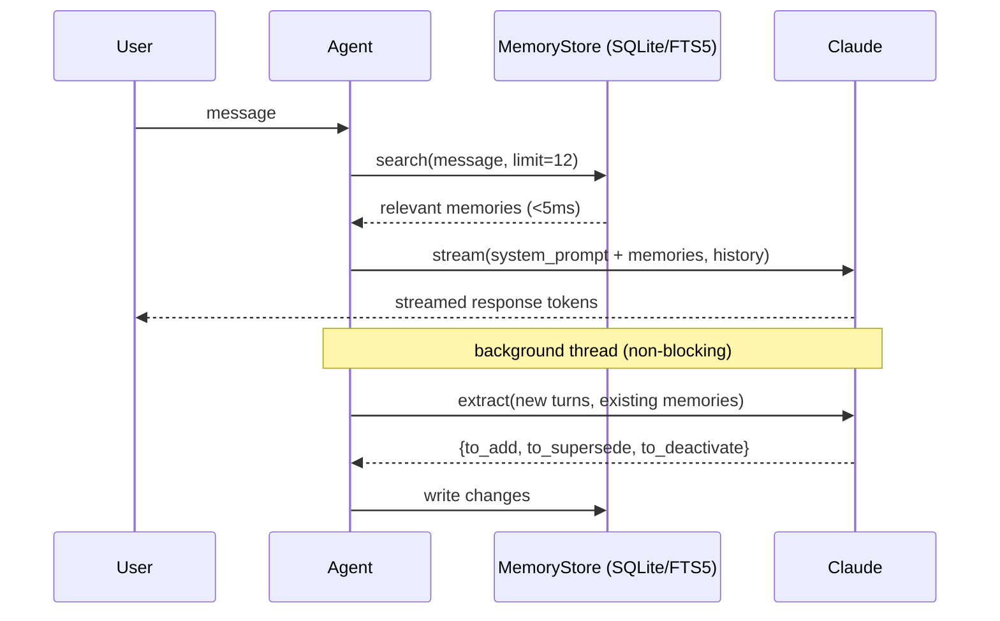
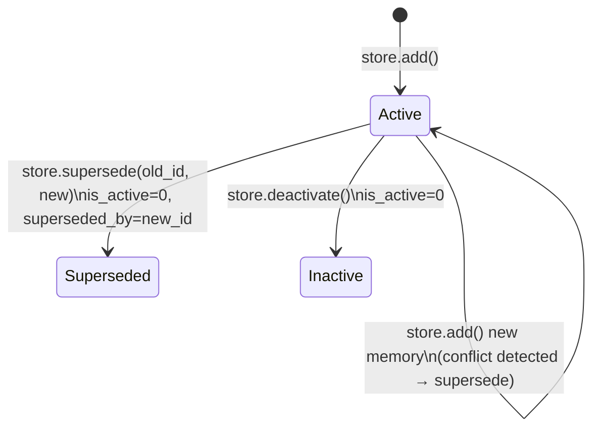

# Memory-Persistent Conversational Agent

Conversational AI that remembers what matters across sessions. Built directly on the Anthropic API — no frameworks, no off-the-shelf memory libraries.

## Setup

```bash
git clone <repo>
cd <repo>
uv sync --group dev
export ANTHROPIC_API_KEY="sk-ant-..."   # console.anthropic.com/settings/keys
```

## Usage

```bash
python main.py                    # new session
python main.py --session <uuid>   # resume with same memory store, fresh conversation
python main.py --list-memories    # inspect stored memories
python main.py --forget <id>      # deactivate a memory by id or 8-char prefix
```

## Demo

```bash
python demo.py
```

Runs two sessions against the same database. Session 1 establishes who you are, your preferences, and a decision. Session 2 is a fresh agent instance with no conversation history — it should use that context without being told again.

## Design

### Per-turn flow



### Memory lifecycle



The hard part of this problem isn't storage — it's deciding what to store. Storing everything and retrieving by similarity sounds right but fails in practice: the store fills with noise and the agent gets more confused over time, not less.

My answer is to use the LLM itself as the memory curator. After each turn, a background call analyzes only the new messages and returns structured JSON describing what to add, what supersedes existing memories, and what to discard. This is slower than a rules-based filter but handles the cases that matter: implicit preferences, one-time decisions, and things that contradict what was said earlier.

**Storage** — SQLite with an FTS5 virtual table for full-text search. FTS5 is an inverted index so query time is flat regardless of store size; measured p50 is ~1ms at 1,000 entries, well within the 200ms budget. WAL mode lets the background extraction thread write concurrently with the main thread's reads.

**Extraction is async** — the extractor runs in a background thread after each response streams. This keeps first-token latency unaffected by extraction cost. The agent tracks `_extracted_up_to`, a cursor into the conversation list, so each turn gets extracted exactly once — no re-processing earlier turns, no duplicates.

**Conflict resolution** — when new information contradicts an existing memory, the old row is marked `is_active=0` with a `superseded_by` pointer to the replacement. Nothing is hard-deleted; the history is preserved.

**Sensitive data** — regex patterns reject credentials, SSNs, and API tokens before they reach storage. The extraction prompt also instructs the LLM to skip secrets, but the regex is the authoritative filter.

**The main limitation** — FTS5 is keyword-based, so it misses semantic matches. Saying "I hate boilerplate" won't retrieve a memory tagged "concise code preference" unless there's word overlap. Embedding-based retrieval layered on top of FTS5 is the obvious next step.

## What I'd build next

- Embedding retrieval alongside FTS5 for semantic recall
- Importance decay for memories that are never accessed (the columns are already there)
- Write-time dedup via cosine similarity before inserting near-duplicate memories

## Tests

```bash
uv run pytest tests/ -v
```

Covers the core memory logic: CRUD, FTS5 search and filtering, persistence across process restarts, conflict resolution, and sensitive-data rejection.

## Time spent

~6 hours: design (45m), storage + retrieval (75m), extraction + agent (90m), tests (60m), README + demo (50m).
