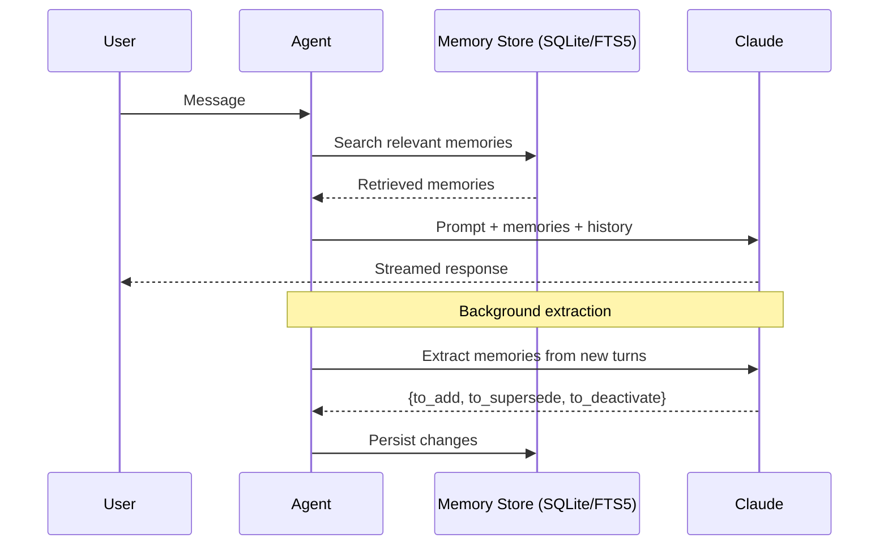
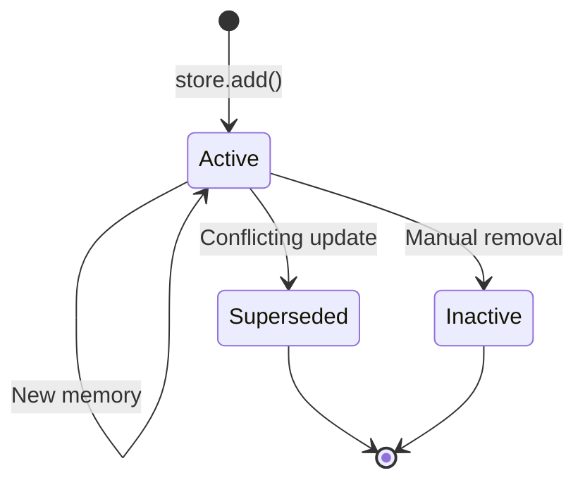
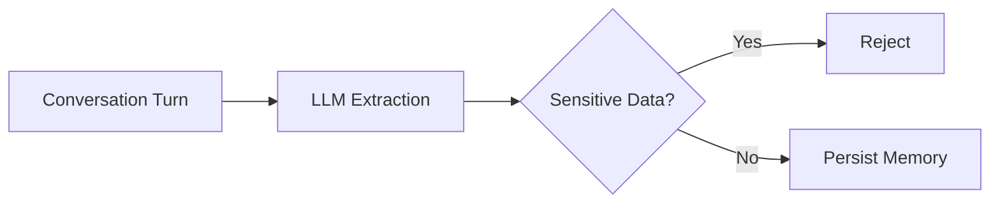
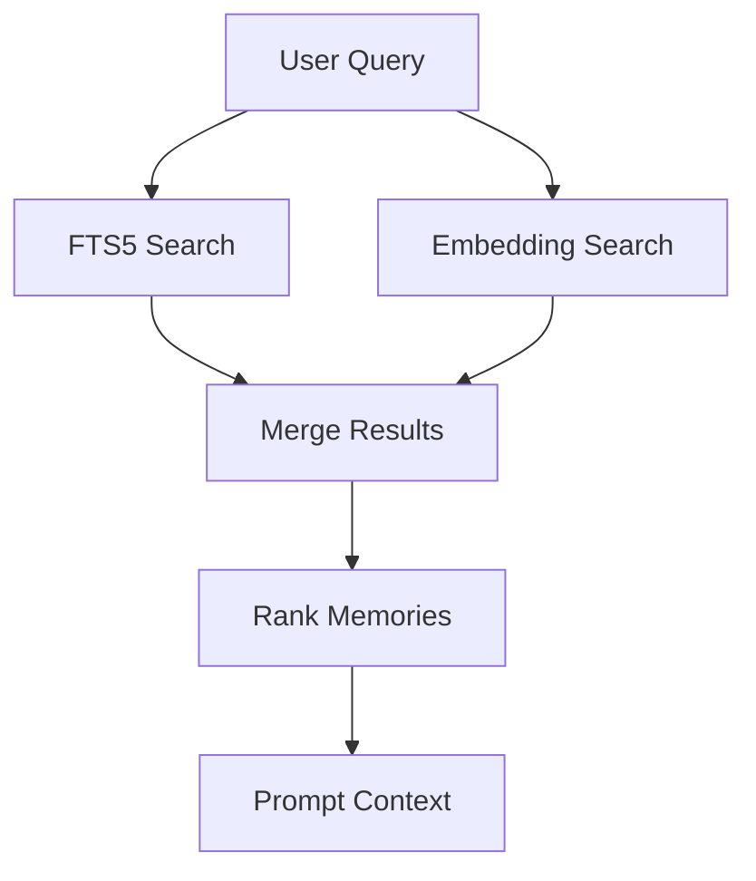

# Memory-Persistent Conversational Agent

A conversational AI that remembers what matters across sessions.

Built directly on the Anthropic API with SQLite for persistence. No agent frameworks, memory libraries, or orchestration layers.

The goal was to answer a simple question:

> If a user starts a new conversation tomorrow, what should the assistant still know?

The challenge isn't storing conversations. It's deciding what deserves to be remembered.

Instead of storing every message, the agent uses the LLM itself to curate memory, extracting preferences, decisions, and long-term context while ignoring transient conversation noise.

---

## Setup

```bash
git clone <repo>
cd <repo>

uv sync --group dev

export ANTHROPIC_API_KEY="<your-anthropic-api-key>"
```

Get an API key from:

https://console.anthropic.com/settings/keys

---

## Usage

Start a new session:

```bash
python main.py
```

Resume an existing memory store with a fresh conversation:

```bash
python main.py --session <uuid>
```

Inspect stored memories:

```bash
python main.py --list-memories
```

Deactivate a memory:

```bash
python main.py --forget <id>
```

---

## Demo

```bash
python demo.py
```

The demo runs two independent sessions against the same memory database.

### Session 1

The user shares:

* who they are
* personal preferences
* a decision they made

### Session 2

A completely new agent instance starts with no conversation history.

The only shared state is the memory database.

The agent should still remember relevant information from the first session and use it naturally in conversation.

---

# Design

The storage layer is straightforward.

The difficult part is deciding what should be remembered.

A naive solution stores every message and retrieves similar conversations later. That sounds reasonable at first, but it quickly fills the memory store with noise.

Over time the agent becomes less useful because retrieval starts surfacing irrelevant information.

Instead, the system treats memory as a curation problem.

After each conversation turn, a background extraction step analyzes only the newly added messages and decides:

* what should be remembered
* what updates existing memory
* what should be discarded

The result is a structured memory store that grows slowly and remains useful.

---

## Per-Turn Flow

When a user sends a message:

1. Search the memory store for relevant memories.
2. Inject retrieved memories into the prompt.
3. Stream the model response immediately.
4. Extract memories from the newly added turns in the background.
5. Persist any memory updates.



The extraction process is asynchronous, so memory processing does not affect response latency.

To avoid repeatedly processing old conversations, the agent maintains an extraction cursor (`_extracted_up_to`). Each turn is analyzed exactly once.

---

## Storage

Memories are stored in SQLite and indexed with FTS5.

FTS5 provides fast keyword-based retrieval using an inverted index.

On a store of roughly 1,000 memories:

* p50 query latency ≈ 1 ms
* retrieval remains effectively constant-time at this scale

SQLite runs in WAL mode, allowing concurrent reads and writes between the main conversation thread and the background extraction thread.

The goal was not to build a distributed memory system, but a simple, inspectable implementation with good enough performance.

---

## Memory Lifecycle

Memories are versioned rather than deleted.

When new information conflicts with an existing memory, the old memory is marked inactive and linked to the replacement.

Example:

```text
Old memory:
"I live in Pune"

New memory:
"I moved to Bengaluru"
```

The original record remains in the database, but only the newer memory is considered active.



This preserves history while ensuring retrieval uses the most current information.

---

## Memory Extraction

The extractor is intentionally simple.

Rather than relying on heuristics or rules, the LLM receives:

* newly added conversation turns
* relevant existing memories

It returns structured JSON describing memory updates:

```json
{
  "to_add": [],
  "to_supersede": [],
  "to_deactivate": []
}
```

This allows the system to handle:

* implicit preferences
* corrected facts
* long-term decisions
* changing user context

without requiring handcrafted extraction logic.

---

## Sensitive Data

Certain categories of information should never be stored.

Before writing any memory, the system filters common secret patterns such as:

* API keys
* passwords
* tokens
* Sensitive personal information

The extraction prompt also instructs the model not to store secrets, but the regex filter is treated as the authoritative safeguard.



---

## Limitations

The current retrieval layer is keyword-based.

This means semantic matches can be missed.

For example:

```text
Memory:
"I prefer concise code."

Later query:
"I hate boilerplate."
```

A human sees these as related.

FTS5 may not.

This is the largest weakness of the current implementation.

---

## Future Work

The next improvement would be embedding-based retrieval alongside FTS5.

That would combine:

* fast keyword lookup
* semantic memory recall

Architecture would look like:



Other areas worth exploring:

* memory importance scoring
* decay of unused memories
* near-duplicate detection
* retrieval ranking based on historical usefulness
* separation of short-term and long-term memory

---

## Testing

Run the test suite:

```bash
uv run pytest tests/ -v
```

Current tests cover:

* CRUD operations
* FTS5 search
* persistence across process restarts
* conflict resolution
* memory activation/deactivation
* sensitive-data filtering

---

## Conclusion

Most memory systems focus on storage.

I am more interested in the decision-making process behind memory itself.

Humans don't remember every conversation. They remember things that matter.

This design is an attempt to apply the same principle to conversational AI: not perfect recall, but selective and useful memory.
